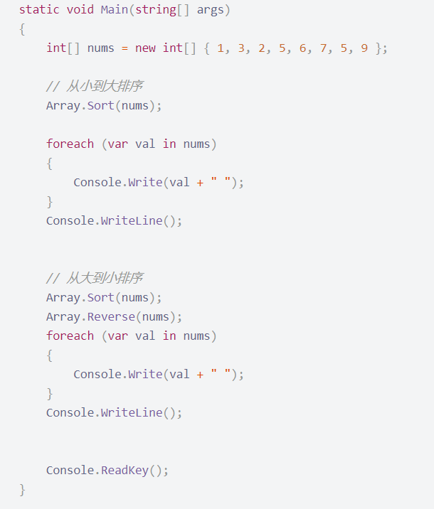
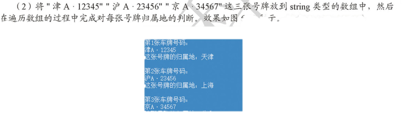

### ASP.NET

2022/10/5/星期三==========>错题

<hr>

<span style="color:Orange">2.(2分)多选题</span>	以下对构造函数说法正确的是（BCD）

A.构造函数 的名称要与本类的名称不同

<span style="color:red">B.构造函数是一个特殊的函数，是在创建对象时执行的方法</span>

<span style="color:red">C.构造函数具有与类相同的名称，通常用来初始化对象的数据成员</span>

<span style="color:red">D.构造函数没有返回值</span>

<hr>

<span style="color:Orange">9.(2分)多选题</span>	一个数组的定义需要包含（ABC）个要素

<span style="color:red">A.元素类型</span>

<span style="color:red">B.数组的维数</span>

<span style="color:red">C.每个维数的上下限</span>

D.索引	

<hr>

<span style="color:Orange">10.(2分)多选题</span>	数组的基本操作主要有（CD）

A.比较

B.查询

<span style="color:red">C.遍历</span>

<span style="color:red">D.排序</span>

<hr>

###### 星期一作业的讲解...

```c#
//作业：
//1、定义一个一维数组，保存小明语数英体四门课的成绩（成绩自定），并输出成绩。
using System;
using System.Collections.Generic;
using System.Linq;
using System.Text;
using System.Threading.Tasks;

namespace Demo
{
    class Program
    {
        static void Main(string[] args)
        {
            int[] score = new int[4] { 95, 88, 80, 96 };
            Console.WriteLine("小明的各科成绩如下：");
            for (int i = 0; i < 4; i++)//利用循环将信息输出
            {
                Console.Write("  " + score[i] + "  ");//输出的信息
            }
            Console.ReadLine();
        }
    }
}

```

<hr>

```c#
//2、利用二维数组以横版形式输出古诗《春晓》
using System;
using System.Collections.Generic;
using System.Linq;
using System.Text;
using System.Threading.Tasks;
namespace Demo
{
    class Program
    {
        static void Main(string[] args)
        {
            char[][] arr = new char[4][];// 创建一个4行的二维数组
            arr[0] = new char[] { '春', '眠', '不', '觉', '晓' };// 为每一行赋值
            arr[1] = new char[] { '处', '处', '闻', '啼', '鸟' };
            arr[2] = new char[] { '夜', '来', '风', '语', '声' };
            arr[3] = new char[] { '花', '落', '知', '多', '少' };
            /* 横版输出 */
            Console.WriteLine("-----横版-----");
            for (int i = 0; i < 4; i++)
            {                           // 循环4行
                for (int j = 0; j < 5; j++)
                {                         // 循环5列
                    Console.Write(arr[i][j]);                   // 输出数组中的元素
                }
    if (i % 2 == 0)
                {
                    Console.WriteLine(",");                     // 如果是一、三句，输出逗号
                }
                else
                {
                    Console.WriteLine("。");                     // 如果是二、四句，输出句号
                }
/* 思考：竖版输出 */
            Console.WriteLine("\n-----竖版-----");
            for (int j = 0; j < 5; j++)
            {                           // 列变行
                for (int i = 3; i >= 0; i--)
                {                  // 行变列，反序输出
                    Console.Write(arr[i][j]);                   // 输出数组中的元素
                }
                Console.WriteLine();                                //换行
            }
            Console.WriteLine("。，。，");						//输出最后的标点
            Console.ReadLine();
        }
}
```

<hr>

##### 3.对数组进行排序




<hr>

4、模拟用户注册及登陆。首先填写帐户内容，包括：帐号、密码、邮箱、电话、住址，在注册过程中需要输入两次密码，校验密码是否相同，并验证电话号码是否为11位。当用户输入y确认注册成功后，让用户登录，并显示登录结果。

```c
using System;
using System.Collections.Generic; 
using System.Linq;
using System.Text;
using System.Threading.Tasks;

namespace Demo
{
    class Program
    {
        static void Main(string[] args)
        {
            string userName = null; //创建用户账号变量，初始值为null
            string password = null; //创建用户密码变量，初始值为null
            string email = null;//创建用户邮箱变量，初始值为null
            string phone = null;//创建用户电话变量，初始值为null
            string address = null;//创建用户住址变量，初始值为null
            Console.WriteLine("欢迎来到XXX网，请新用户注册账号！\n");

            bool registerNotSuccess = true;//判断用户注册是否成功
            do
            {
                bool nameFlag = true;//验证用户名
                do
                {
                    Console.Write("请输入账户名：");
                    userName = Console.ReadLine();//记录用户名
                    if ("".Equals(userName))//判断用户名是否为空
                    {
                        Console.WriteLine("用户名不能为空，请重新输入！");
                    }
                    else
                    {
                        nameFlag = false;
                    }
                } while (nameFlag);

                bool pwdFlag = true;//验证密码
                do
                {
                    Console.Write("请输入密码：");
                    String pwdTmp1 = Console.ReadLine();//记录首次输入密码
                    Console.Write("请再次输入密码：");
                    String pwdTmp2 = Console.ReadLine();//记录第二次输入密码
                    if (pwdTmp1.Equals(pwdTmp2))//判断密码是否一致
                    {
                        pwdFlag = false;
                        password = pwdTmp1;
                    }
                    else
                    {
                        Console.WriteLine("对不起，您两次输入的密码不一致，请重新输入！");
                    }
                } while (pwdFlag);

                Console.Write("请输入邮箱地址：");
                email = Console.ReadLine();//记录Email

                bool phoneFlag = true;//验证电话号码
                do
                {
                    Console.Write("请输入电话：");
                    phone = Console.ReadLine();//记录电话号码
                    if (phone.Length != 11)//判断长度是否为11
                    {
                        Console.WriteLine("输入的电话号码有误，请重新输入！");
                    }
                    else
                    {
                        phoneFlag = false;
                    }
                } while (phoneFlag);
                Console.Write("请输入住址（可选）：");
                address = Console.ReadLine();//记录地址

                bool notSure = true;//核对用户注册信息
                do
                {
                    Console.WriteLine("\n****请您核对注册的信息****");
                    Console.WriteLine("账号：" + userName);
                    Console.WriteLine("邮箱：" + email);
                    Console.WriteLine("电话：" + phone.Substring(0, 3) + "****" + phone.Substring(7));//电话号中间4位用*代替
                    Console.WriteLine("住址：" + address);
                    Console.WriteLine("************************");
                    Console.Write("确认请输入Y，重新注册请输入N：");
                    String answer = Console.ReadLine();//确认是否信息是否正确
                    if (answer.ToUpper().Equals("Y"))//如果输入Y，则表示正确
                    {
                        registerNotSuccess = false;
                        notSure = false;
                    }
                    else if (answer.ToUpper().Equals("N"))//如果输入N，表示错误
                    {
                        registerNotSuccess = true;
                        notSure = false;
                    }
                    else
                    {
                        Console.WriteLine("您的输入有误，请重新输入");
                    }
                } while (notSure);
            } while (registerNotSuccess);

            Console.WriteLine("\n欢迎来到XXX网，请登录！");

            bool loginFlag = true;//判断登录是否成功
            do
            {

                Console.Write("请输入账号：");
                String inputName = Console.ReadLine();//记录用户名
                Console.Write("请输入密码：");
                String inputPwd = Console.ReadLine();//记录密码
                if (null != userName && null != password)//判断用户名和密码是否为空
                {
             if (userName == inputName && password == inputPwd)//判断用户名和密码是否正确
                    {
                        Console.WriteLine("欢迎登录，" + userName);//显示登录用户信息
                        loginFlag = false;
                    }
                    else
                    {
                        Console.WriteLine("您输入的账号密码有误，请重新输入！");
                    }
                }
            } while (loginFlag);
            Console.ReadLine();
        }
    }
}
```

<hr>



```c#
using System;
using System.Collections.Generic;
using System.Linq;
using System.Text;
using System.Threading.Tasks;
namespace Demo
{
    class Program
    {
        static void Main(string[] args)
        {
            // 初始化一个String类型的数组carNum
            string[] carNum = { "津A·12345", "沪A·23456", "京A·34567" };
            for (int i = 0; i < carNum.Length; i++)
            {
                // 控制台输出提示信息
                Console.WriteLine("第" + (i + 1) + "张车牌号码：");
                Console.WriteLine(carNum[i]);// 控制台输出提示信息
                string province = carNum[i].Substring(0,1);// 获取车牌第一字符
                if (province == "津")// 判断第一个字符是否是"津"
                {
                    Console.WriteLine("这张号牌的归属地：天津" + "\n");
                }
                if (province == "沪")// 判断第一个字符是否是"沪"
                {
                    Console.WriteLine("这张号牌的归属地：上海" + "\n");
                }
                if (province == "京")// 判断第一个字符是否是"京"
                {
                    Console.WriteLine("这张号牌的归属地：北京" + "\n");
                }
            }
            Console.ReadLine();
        }
    }
}
```


